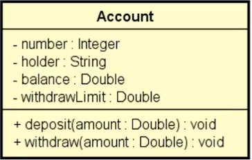

# Projeto Conta Bancária / Bank Account: Withdrawal with Balance and Limit Validation

## 📘 Descrição / Description

Este projeto consiste em um programa orientado a objetos que simula uma conta bancária. O usuário informa os dados da conta, realiza operações de saque e depósito, e o sistema garante que os saques respeitem regras específicas como limite de saque e saldo disponível.

This project consists of an object-oriented program that simulates a bank account. The user inputs the account data, performs withdrawal and deposit operations, and the system ensures withdrawals follow specific rules such as withdrawal limit and available balance.

---

## ✅ Regras do Sistema / System Rules

- O saque só pode ser realizado se houver saldo suficiente.
- O valor do saque não pode ultrapassar o limite de saque.
- O sistema deve exibir mensagens adequadas caso o saque não seja possível.

- Withdrawals can only be made if there is enough balance.
- The withdrawal amount cannot exceed the withdrawal limit.
- The system should display appropriate messages if the withdrawal is not possible.

---

## ⚙️ Funcionalidades / Features

- Cadastro de conta bancária
- Depósito de valores
- Saque com validações
- Exibição do novo saldo após operações

- Bank account registration
- Deposit values
- Withdrawal with validation
- Display new balance after operations

---

## 🧩 Estrutura da Classe / Class Structure

### Diagrama de Classe / Class Diagram

**Account**

---

## 📄 Atributos da Classe `Account` / `Account` Class Attributes

- `number` (Integer): Número da conta / Account number
- `holder` (String): Nome do titular / Account holder
- `balance` (Double): Saldo da conta / Account balance
- `withdrawLimit` (Double): Limite de saque / Withdrawal limit

---

## 🛠️ Métodos da Classe / Class Methods

- `deposit(amount: Double)`: Realiza um depósito / Performs a deposit
- `withdraw(amount: Double)`: Realiza um saque com validação / Performs a validated withdrawal

---

## 🚀 Como Executar / How to Run

1. Clone o repositório
2. Compile e execute a classe principal
3. Insira os dados da conta conforme solicitado
4. Realize operações de depósito e saque

1. Clone the repository
2. Compile and run the main class
3. Enter the account data as requested
4. Perform deposit and withdrawal operations

---

## 📄 Licença / License

Este projeto está licenciado sob a licença MIT.  
This project is licensed under the MIT License.

---
