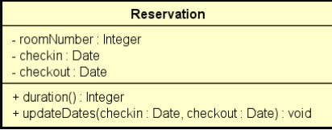

# 🏨 Exercício de Reserva de Hotel / Hotel Reservation Exercise

## 📘 Descrição / Description

**PT-BR:**  
O objetivo deste exercício é desenvolver um programa que leia os dados de uma reserva de hotel (número do quarto, data de entrada e data de saída), exiba os dados da reserva com a duração da estadia, permita atualizar as datas da reserva e valide as informações inseridas.

**EN:**  
The goal of this exercise is to develop a program that reads hotel reservation data (room number, check-in date, and check-out date), displays the reservation details including the duration of the stay, allows updating the reservation dates, and validates the entered information.

---

## 📋 Regras de Validação / Validation Rules

- **PT-BR:**
    - As alterações de reserva só podem ser feitas para datas futuras.
    - A data de saída deve ser posterior à data de entrada.

- **EN:**
    - Reservation changes can only be made for future dates.
    - The check-out date must be after the check-in date.

---

## 🧱 Estrutura da Classe / Class Diagram

---

## ✅ Funcionalidades Esperadas / Expected Features

- **PT-BR:**
    - Leitura dos dados de entrada (número do quarto, datas)
    - Exibição da reserva com duração em dias
    - Atualização de datas com validações
    - Exibição de mensagens de erro em caso de dados inválidos

- **EN:**
    - Read input data (room number, dates)
    - Display reservation with duration in days
    - Update dates with validations
    - Show error messages when input data is invalid

---

