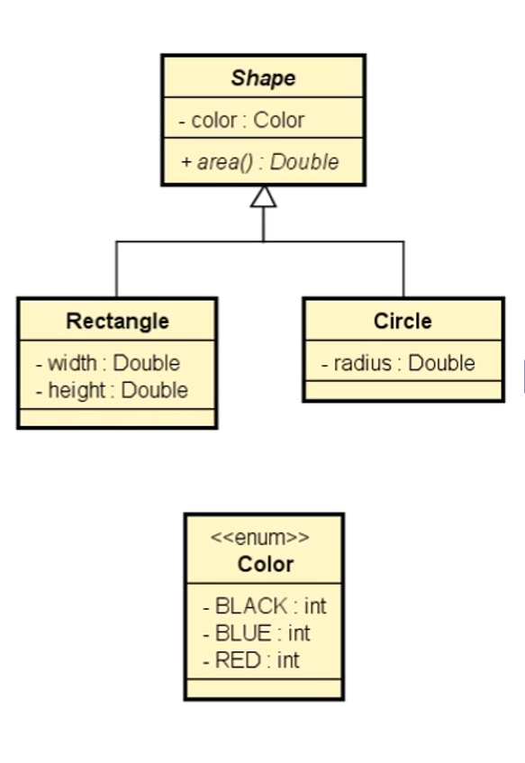

# 📐 Programa de Cálculo de Áreas de Figuras Geométricas – Herança, Polimorfismo e Abstração

## 📋 Descrição (Português)

Este programa lê os dados de `N` figuras geométricas fornecidas pelo usuário, onde cada figura pode ser um retângulo ou um círculo. 
Após a entrada dos dados, o programa calcula e exibe as áreas das figuras na mesma ordem em que foram digitadas.

### 🧱 Diagrama de classes

### 🎯 Objetivo

1. Ler os dados de `N` figuras (N fornecido pelo usuário).
2. Armazenar todas as figuras em uma lista.
3. Exibir as áreas das figuras na ordem em que foram digitadas.

---

## 📋 Description (English)

This program reads data for `N` geometric shapes entered by the user, where each shape can be a rectangle or a circle. 
After data input, the program calculates and displays the areas of the shapes in the same order they were entered.

### 🎯 Objective

1. Read data for `N` shapes (N provided by the user).
2. Store all shapes in a list.
3. Display the areas of the shapes in the order they were entered.

---

