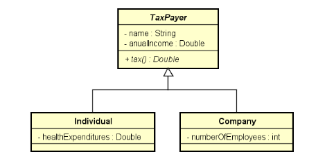

# 💼 Sistema de Cálculo de Impostos – Pessoas Físicas e Jurídicas 

## 📋 Descrição (Português)

Este programa lê os dados de `N` contribuintes (sendo N informado pelo usuário), que podem ser pessoas físicas ou pessoas jurídicas. Após a entrada dos dados, o programa calcula e exibe o valor do imposto pago por cada contribuinte, assim como o total de imposto arrecadado.

### 👥 Tipos de contribuintes

- **Pessoa Física**
    - Dados: nome, renda anual, gastos com saúde
    - Regras para cálculo do imposto:
        - Renda abaixo de 20.000,00 → 15% de imposto
        - Renda de 20.000,00 em diante → 25% de imposto
        - Abatimento de 50% dos gastos com saúde no imposto

- **Pessoa Jurídica**
    - Dados: nome, renda anual, número de funcionários
    - Regras para cálculo do imposto:
        - 16% de imposto sobre a renda anual
        - Se possuir mais de 10 funcionários → 14% de imposto

### 🧮 Exemplos de cálculo

- Pessoa física com renda 50.000,00 e gastos com saúde 2.000,00:  
  imposto = (50000 * 25%) - (2000 * 50%) = 11500,00

- Pessoa jurídica com renda 400.000,00 e 25 funcionários:  
  imposto = 400000 * 14% = 56000,00

### 🎯 Objetivo

1. Ler os dados de `N` contribuintes.
2. Armazenar os contribuintes em uma lista.
3. Exibir o valor do imposto pago por cada contribuinte.
4. Exibir o total de imposto arrecadado.

---

## 📋 Description (English)

This program reads data for `N` taxpayers (N provided by the user), who can be individuals or companies. After data entry, it calculates and displays the tax paid by each taxpayer as well as the total tax collected.

### 👥 Taxpayer types

- **Individual (Physical Person)**
    - Data: name, annual income, health expenditures
    - Tax rules:
        - Income below 20,000.00 → 15% tax
        - Income 20,000.00 or above → 25% tax
        - 50% of health expenditures deducted from tax

- **Company (Legal Person)**
    - Data: name, annual income, number of employees
    - Tax rules:
        - 16% tax on annual income
        - If more than 10 employees → 14% tax

### 🧮 Calculation examples

- Individual with income 50,000.00 and health expenditures 2,000.00:  
  tax = (50000 * 25%) - (2000 * 50%) = 11500.00

- Company with income 400,000.00 and 25 employees:  
  tax = 400000 * 14% = 56000.00

### 🎯 Objective

1. Read data for `N` taxpayers.
2. Store taxpayers in a list.
3. Display the tax paid by each taxpayer.
4. Display the total tax collected.

### 🧱 Class diagram

---

